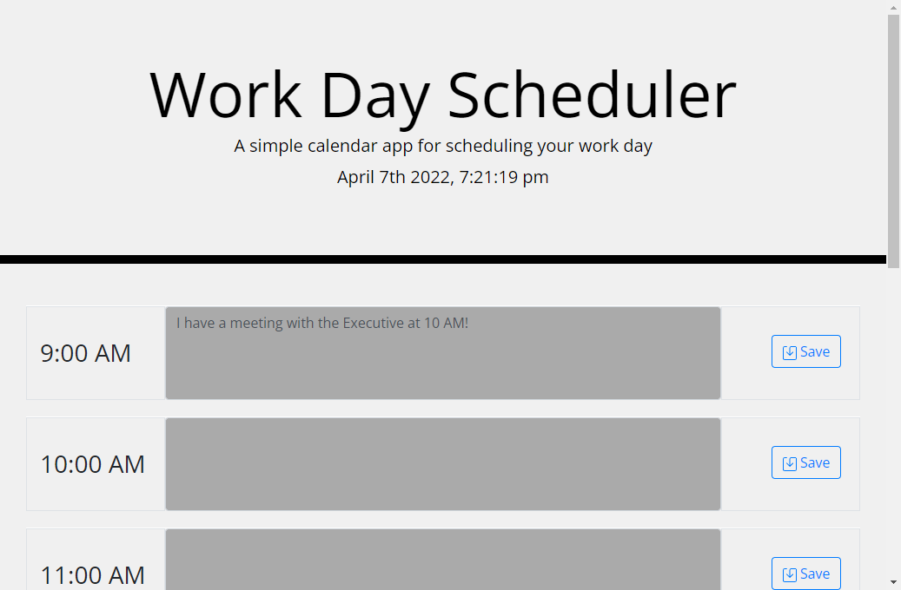

# My Day Planner

This is day planner application shows off my skills in using third party APIs, mainly Bootstrap, jQuery and Method.js. The day planner keeps track of the current date and time and displays it underneath the header. Depending on the current time, the boxes will change colors to indicate the current hour, the past hours and future hours. When you write your plans for the hour into the box and click the save button, they are saved into local storage so when you close the page and bring it back up, they are still there.

## Thank you for checking out my project!

